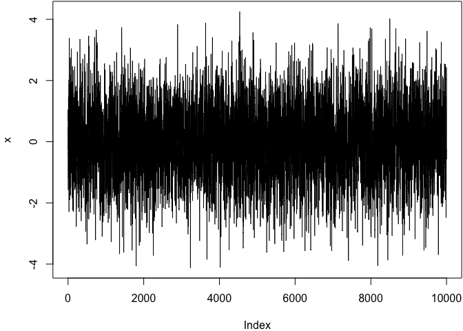
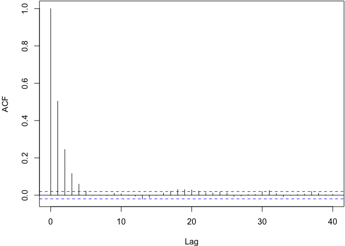
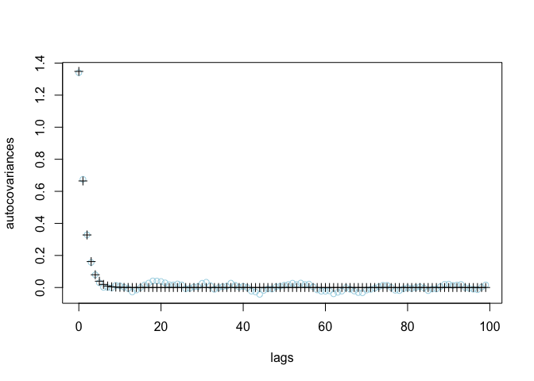

<!-- README.md is generated from README.Rmd. Please edit that file -->

# momentLS

<!-- badges: start -->
<!-- badges: end -->

The goal of momentLS is to implement Moment LS estimators in “Efficient
shape-constrained inference for the autocovariance sequence from a
reversible Markov chain” <https://arxiv.org/abs/2207.12705>

## Installation

You can install the development version of momentLS from
[GitHub](https://github.com/) with:

``` r
# install.packages("devtools")
devtools::install_github("hsong1/momentLS")
```

## Example

We provide a basic usage example of momentLS package using a simulated
AR(1) chain:

``` r
library(momentLS)

# generate an AR(1) chain of length M with rho =.5
set.seed(12345); M=10000
chainParams = list(type="AR", rho = 0.5, M = M)
ch = generateChain(chainParams)
x = ch$x # AR1 chain
par(mar = c(4, 4, .1, .1))
plot(x, type="l"); acf(x)
```



``` r
# compute the empirical autocovariances
r = autocov(x)
# tune delta
delta_hat = tune_delta(x,nSplits = 5,c_M_const = 0)$delta*0.8

# fit MomentLS
m = SR1(r,delta = delta_hat) # fit
```

### Asymptotic variance estimator comparison

``` r
# compute the MomentLS asymptotic variance estimator
MomentLS_avar = asympVariance(weights = m$weights, support = m$support) 

# comparison with  BM, OLBM, init-seq estimators
result = 
  c("Truth"=ch$varTruth,
    "MomentLS"=MomentLS_avar,
    "BM"=M*mcmcse::mcse(ch$x,method="bm")$se^2, 
    "OLBM"=M*mcmcse::mcse(ch$x,method="obm")$se^2,
    "Init-pos"=mcmc::initseq(ch$x)$var.pos,
    "Init-dec"=mcmc::initseq(ch$x)$var.dec,
    "Init-conv"=mcmc::initseq(ch$x)$var.con
  )
```

``` r
library(flextable)
library(tidyr)
# display result
data.frame(t(result)) %>% knitr::kable(digits = 3)
```

| Truth | MomentLS |    BM |  OLBM | Init.pos | Init.dec | Init.conv |
|------:|---------:|------:|------:|---------:|---------:|----------:|
|     4 |    3.971 | 4.376 | 4.326 |    3.926 |    3.888 |     3.885 |

### Comparison of empirical and MomentLS autocovariances

``` r
# first 100 estimated autocovariances
estimated_autocov = computeMoments(support = m$support, weights = m$weights, M = 100)
plot(0:99, r[1:100], col="lightblue", xlab="lags", ylab = "autocovariances", 
     ylim= c(min(r[1:100], estimated_autocov),max(r[1:100], estimated_autocov)))
points(0:99, estimated_autocov,pch=3)
```



### Performance comparison between asymptotic variance estimators using B=100 simulations

``` r
library(foreach)
B=100;
results = foreach(b=1:B,.combine="rbind")%do%{
  set.seed(b)
  ch = generateChain(chainParams) # generate a chain
  r = autocov(ch$x) # compute empirical autocov
  delta_hat = tune_delta(x,nSplits = 1,,c_M_const = 0)$delta*0.8  # tune delta
  m = SR1(r,delta = delta_hat) # fit momentLS
  m_orcl = SR1(r,delta = 1-chainParams$rho) # fit momentLS using oracle delta (=1-rho)

  MomentLS_avar = asympVariance(weights = m$weights, support = m$support)
  MomentLS_avar_orcl = asympVariance(weights = m_orcl$weights, support = m_orcl$support)

  # comparison with  BM, OLBM, init-seq estimators
  result =
    c("Truth"=ch$varTruth,
      "MomentLS"=MomentLS_avar,
      "MomentLS(orcl)"=MomentLS_avar_orcl,
      "BM"=M*mcmcse::mcse(ch$x,method="bm")$se^2,
      "OLBM"=M*mcmcse::mcse(ch$x,method="obm")$se^2,
      "Init-pos"=mcmc::initseq(ch$x)$var.pos,
      "Init-dec"=mcmc::initseq(ch$x)$var.dec,
      "Init-conv"=mcmc::initseq(ch$x)$var.con
    )
  return(result)
}
```

``` r
library(dplyr)
aVar_sqdiffs = data.frame((results[,-1] - results[,1])^2)
aVar_sqdiffs %>%
  gather() %>%
  rename(Estimator=key) %>%
  group_by(Estimator) %>%
  summarise(Average_MSE=mean(value),SE=sd(value)/sqrt(B)) %>%
  knitr::kable(digits=3)
```

| Estimator      | Average_MSE |    SE |
|:---------------|------------:|------:|
| BM             |       0.304 | 0.051 |
| Init.conv      |       0.069 | 0.012 |
| Init.dec       |       0.082 | 0.014 |
| Init.pos       |       0.103 | 0.018 |
| MomentLS       |       0.038 | 0.005 |
| MomentLS.orcl. |       0.024 | 0.004 |
| OLBM           |       0.206 | 0.030 |
