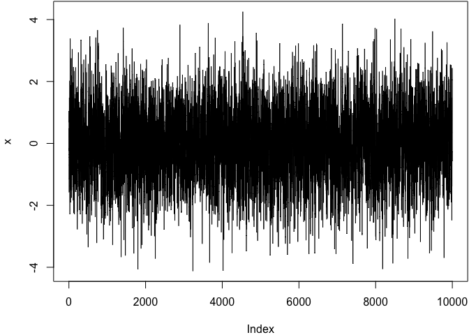
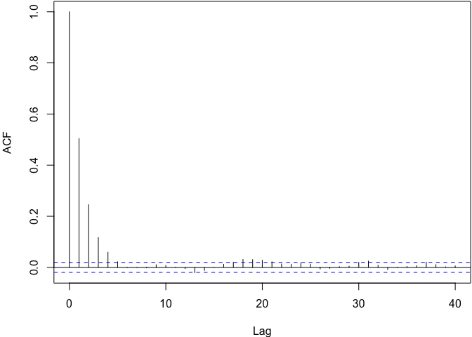
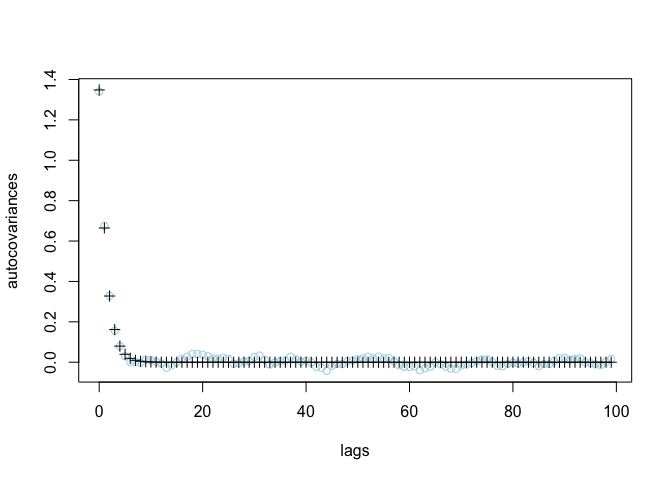

<!-- README.md is generated from README.Rmd. Please edit that file -->

# momentLS

<!-- badges: start -->
<!-- badges: end -->

Implementation of Moment LS estimators in

- “Efficient shape-constrained inference for the autocovariance sequence
  from a reversible Markov chain” <https://arxiv.org/abs/2207.12705>
- “Multivariate moment least-squares estimators for reversible Markov
  chains” <https://arxiv.org/abs/2310.06330>
- “Weighted shape-constrained estimation for the autocovariance sequence
  from a reversible Markov chain” <https://arxiv.org/abs/2408.03024>

## Installation

You can install the development version of momentLS from
[GitHub](https://github.com/) with:

``` r
# install.packages("devtools")
devtools::install_github("hsong1/momentLS")
```

## Example

We provide a basic usage example of momentLS package using a simulated
AR(1) chain:

``` r
library(momentLS)

# generate an AR(1) chain of length M with rho =.5
set.seed(12345); M=10000
chainParams = list(type="AR", rho = 0.5, M = M)
ch = generateChain(chainParams)
x = ch$x # AR1 chain
par(mar = c(4, 4, .1, .1))
plot(x, type="l"); acf(x)
```



``` r
# compute the empirical autocovariances
r = autocov(x)
# tune delta
delta_tilde = tune_delta(x,nSplits = 5,c_M_const = 0)$delta*0.8

# fit MomentLS
m = SR1(r,delta = delta_tilde) # fit
```

### Asymptotic variance estimator comparison

``` r
# compute the MomentLS asymptotic variance estimator
MomentLS_avar = asympVariance(weights = m$weights, support = m$support) 

# comparison with  BM, OLBM, init-seq estimators
result = 
  c("Truth"=ch$varTruth,
    "MomentLS"=MomentLS_avar,
    "BM"=M*mcmcse::mcse(ch$x,method="bm")$se^2, 
    "OLBM"=M*mcmcse::mcse(ch$x,method="obm")$se^2,
    "Init-pos"=mcmc::initseq(ch$x)$var.pos,
    "Init-dec"=mcmc::initseq(ch$x)$var.dec,
    "Init-conv"=mcmc::initseq(ch$x)$var.con
  )
```

``` r
library(flextable)
library(tidyr)
# display result
data.frame(t(result)) %>% knitr::kable(digits = 3)
```

| Truth | MomentLS |    BM |  OLBM | Init.pos | Init.dec | Init.conv |
|------:|---------:|------:|------:|---------:|---------:|----------:|
|     4 |    3.971 | 4.376 | 4.326 |    3.926 |    3.888 |     3.885 |

### Comparison of empirical and MomentLS autocovariances

``` r
# first 100 estimated autocovariances
estimated_autocov = computeMoments(support = m$support, weights = m$weights, M = 100)
plot(0:99, r[1:100], col="lightblue", xlab="lags", ylab = "autocovariances", 
     ylim= c(min(r[1:100], estimated_autocov),max(r[1:100], estimated_autocov)))
points(0:99, estimated_autocov,pch=3)
```



### Performance comparison between asymptotic variance estimators using B=100 simulations

``` r
library(foreach)
B=100;
results = foreach(b=1:B,.combine="rbind")%do%{
  set.seed(b)
  ch = generateChain(chainParams) # generate a chain
  r = autocov(ch$x) # compute empirical autocov
  delta_tilde = tune_delta(ch$x,nSplits = 5,c_M_const = 0)$delta*0.8  # tune delta
  m = SR1(r,delta = delta_tilde) # fit momentLS
  m_orcl = SR1(r,delta = 1-chainParams$rho) # fit momentLS using oracle delta (=1-rho)

  MomentLS_avar = asympVariance(weights = m$weights, support = m$support)
  MomentLS_avar_orcl = asympVariance(weights = m_orcl$weights, support = m_orcl$support)

  # comparison with  BM, OLBM, init-seq estimators
  result =
    c("Truth"=ch$varTruth,
      "MomentLS"=MomentLS_avar,
      "MomentLS(orcl)"=MomentLS_avar_orcl,
      "BM"=M*mcmcse::mcse(ch$x,method="bm")$se^2,
      "OLBM"=M*mcmcse::mcse(ch$x,method="obm")$se^2,
      "Init-pos"=mcmc::initseq(ch$x)$var.pos,
      "Init-dec"=mcmc::initseq(ch$x)$var.dec,
      "Init-conv"=mcmc::initseq(ch$x)$var.con
    )
  return(result)
}
```

``` r
library(dplyr)
aVar_sqdiffs = data.frame((results[,-1] - results[,1])^2)
aVar_sqdiffs %>%
  gather() %>%
  rename(Estimator=key) %>%
  group_by(Estimator) %>%
  summarise(Average_MSE=mean(value),SE=sd(value)/sqrt(B)) %>%
  knitr::kable(digits=3)
```

| Estimator      | Average_MSE |    SE |
|:---------------|------------:|------:|
| BM             |       0.304 | 0.051 |
| Init.conv      |       0.069 | 0.012 |
| Init.dec       |       0.082 | 0.014 |
| Init.pos       |       0.103 | 0.018 |
| MomentLS       |       0.054 | 0.012 |
| MomentLS.orcl. |       0.024 | 0.004 |
| OLBM           |       0.206 | 0.030 |

### Example of Multivariate momentLS estimator

We illustrate a simple usage example demonstrating how to compute the
multivariate momentLS estimator introduced in
<https://arxiv.org/abs/2310.06330>.

``` r
# simulate d=10 chains
set.seed(1);  
d=10 # generate g(X_t) where g:X->R^d
chainParams = list(type="MH",  M = 10000,  nStates = 100, 
                   g = matrix(rnorm(100*d),ncol=d), discreteMC = simulate_discreteMC(nStates = 100), d = d)
ch_mh = generateChain(chainParams)
x = ch_mh$x 
dim(x) # g(X_t) is a matrix with 10000 rows and d columns
#> [1] 10000    10

# compute the multivariate MomentLS asymptotic variance estimator
avarMLSE  = mtvMLSE(x = x)
knitr::kable(avarMLSE$cov,digits=2) # estimated asymptotic covariance matrix (d by d)
```

|       |       |       |       |       |       |       |       |       |       |
|------:|------:|------:|------:|------:|------:|------:|------:|------:|------:|
|  2.27 | -0.36 |  0.02 | -0.19 | -0.38 |  0.37 |  0.30 |  0.31 |  0.15 |  0.77 |
| -0.36 |  3.65 | -0.56 | -0.17 |  0.96 | -0.36 | -0.58 |  0.28 |  0.45 |  0.39 |
|  0.02 | -0.56 |  2.77 | -0.11 |  0.03 | -0.30 | -0.41 |  0.33 | -0.42 | -0.24 |
| -0.19 | -0.17 | -0.11 |  3.29 | -0.21 | -0.58 | -0.54 | -0.18 |  1.02 | -0.16 |
| -0.38 |  0.96 |  0.03 | -0.21 |  5.06 | -0.69 | -0.01 |  0.32 |  0.13 | -1.45 |
|  0.37 | -0.36 | -0.30 | -0.58 | -0.69 |  2.57 |  0.55 | -0.18 |  0.41 | -0.18 |
|  0.30 | -0.58 | -0.41 | -0.54 | -0.01 |  0.55 |  3.71 |  0.78 |  0.30 | -0.15 |
|  0.31 |  0.28 |  0.33 | -0.18 |  0.32 | -0.18 |  0.78 |  3.67 | -0.31 |  0.14 |
|  0.15 |  0.45 | -0.42 |  1.02 |  0.13 |  0.41 |  0.30 | -0.31 |  3.74 |  0.56 |
|  0.77 |  0.39 | -0.24 | -0.16 | -1.45 | -0.18 | -0.15 |  0.14 |  0.56 |  4.35 |

``` r


# compare with BM, OLBM, init-seq estimators
result=c(
mtvMLSE = sum((avarMLSE$cov-ch_mh$varTruth)^2),
mtvBM = sum((mcmcse::mcse.multi(x,method="bm" ,r = 1)$cov-ch_mh$varTruth)^2),
mtvOBM = sum((mcmcse::mcse.multi(x,method="obm",r = 1)$cov-ch_mh$varTruth)^2),
mtvInit = sum((mcmcse::mcse.initseq(x)$cov-ch_mh$varTruth)^2)  
)

result
#>  mtvMLSE    mtvBM   mtvOBM  mtvInit 
#> 4.183798 5.143038 3.840308 5.200378
```

``` r
results = foreach(b=1:B,.combine="rbind")%do%{
  set.seed(b+12345)
  d=10 # generate g(X_t) where g:X->R^d
  chainParams = list(type="MH",  M = 10000,  nStates = 100, 
                   g = matrix(rnorm(100*d),ncol=d), discreteMC = simulate_discreteMC(nStates = 100), d = d)
  ch_mh = generateChain(chainParams)
  x = ch_mh$x 

  # compute the multivariate MomentLS asymptotic variance estimator
  avarMLSE  = mtvMLSE(x = x)


  # compare with BM, OLBM, init-seq estimators
  result=c(
    mtvMLSE = sum((avarMLSE$cov-ch_mh$varTruth)^2),
    mtvBM = sum((mcmcse::mcse.multi(x,method="bm" ,r = 1)$cov-ch_mh$varTruth)^2),
    mtvOBM = sum((mcmcse::mcse.multi(x,method="obm",r = 1)$cov-ch_mh$varTruth)^2),
    mtvInit = sum((mcmcse::mcse.initseq(x)$cov-ch_mh$varTruth)^2)  
  )
  
  
  return(result)
}

results %>% data.frame() %>% 
  gather() %>%
  rename(Estimator=key) %>%
  group_by(Estimator) %>%
  summarise(Average_MSE=mean(value),SE=sd(value)/sqrt(B)) %>%
  knitr::kable(digits=3)
```

| Estimator | Average_MSE |    SE |
|:----------|------------:|------:|
| mtvBM     |       3.037 | 0.091 |
| mtvInit   |       2.557 | 0.137 |
| mtvMLSE   |       2.043 | 0.086 |
| mtvOBM    |       2.635 | 0.084 |
